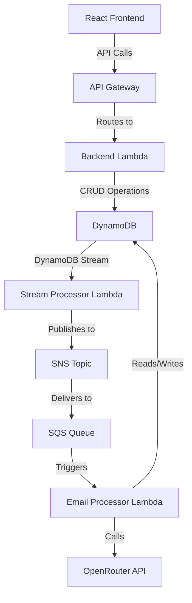

# System Patterns: Stitch Fix Client Engagement Acceleration System

## System Architecture

The Client Engagement Acceleration System follows an event-driven architecture with the following key components:

### Key Components

1. **Frontend Application**: Single React application with multiple views
   - User management interface
   - Email dashboard interface

2. **Backend Application**: Express.js application deployed as Lambda
   - API endpoints for users and emails
   - Database operations

3. **Stream Processor Lambda**: Processes DynamoDB stream events
   - Transforms database events into domain events
   - Publishes events to SNS for durable processing

4. **Email Processor Lambda**: Event-driven processor deployed as Lambda
   - Consumes events from SQS
   - Calculates engagement scores
   - Generates personalized emails using OpenRouter

5. **Data Storage**: DynamoDB tables
   - Users table with DynamoDB Stream enabled
   - Emails table

6. **Event Bus**: SNS topic + SQS queue for durable, rate-controlled processing

## Key Technical Decisions

### 1. Event-Driven Architecture with DynamoDB Streams

**Decision**: Use DynamoDB Streams to capture database changes and trigger event processing.

**Rationale**:
- Decouples the event generation from API operations
- Ensures no events are lost if there's an issue with the backend Lambda
- Provides a reliable source of truth for all data changes

### 2. SNS-SQS Combination for Event Processing

**Decision**: Use SNS to publish events and SQS to consume them.

**Rationale**:
- Provides better control over the rate at which the Processor Lambda is invoked
- Adds durability through the SNS/SQS combination
- Enables handling outages gracefully with message retention
- Allows for future expansion to multiple consumers

### 3. Serverless Architecture with AWS Lambda

**Decision**: Implement all backend services as AWS Lambda functions.

**Rationale**:
- Scales automatically based on demand
- Reduces operational overhead
- Pay-per-use pricing model
- Integrates well with other AWS services

### 4. Single Frontend Application

**Decision**: Consolidate all UI functionality into a single React application.

**Rationale**:
- Simplifies development and deployment for a demo project
- Provides a cohesive user experience
- Reduces complexity in routing and state management

### 5. Algorithmic Approach for Engagement Scoring

**Decision**: Use a simple algorithmic approach for engagement scoring rather than machine learning.

**Rationale**:
- Faster to implement for a 1-day demo
- More explainable and transparent
- Sufficient for demonstrating the concept
- Can be extended to ML-based approaches in the future

### 6. OpenRouter for LLM Integration

**Decision**: Use OpenRouter for generating personalized emails.

**Rationale**:
- Provides access to multiple LLM models through a single API
- Simplifies integration compared to direct model hosting
- Offers flexibility in model selection

## Design Patterns

### 1. Repository Pattern

Used in data access layers to abstract database operations and provide a clean interface for working with domain objects.

### 2. Event Sourcing

The system captures all changes to application state as a sequence of events, which can be used to reconstruct the current state or analyze historical changes.

### 3. CQRS (Command Query Responsibility Segregation)

Separates read and write operations, with writes flowing through the event system and reads coming directly from DynamoDB.

### 4. Circuit Breaker

Implemented for external service calls (like OpenRouter) to prevent cascading failures and provide graceful degradation.

### 5. Dependency Injection

Used throughout the codebase to improve testability and maintainability.

## Component Relationships

### Frontend-Backend Interaction

The React frontend communicates with the backend through RESTful API calls. The API Gateway routes these requests to the Backend Lambda, which performs the necessary operations and returns responses.

### Event Flow

1. User updates trigger DynamoDB Stream events
2. Stream Processor Lambda processes these events and publishes to SNS
3. SNS delivers events to SQS
4. Email Processor Lambda consumes events from SQS
5. Email Processor Lambda updates user engagement scores and generates emails as needed

### Data Flow

1. User data is stored in DynamoDB
2. Engagement scores are calculated based on user data
3. Generated emails are stored in DynamoDB
4. Frontend retrieves and displays user and email data

## Scalability Considerations

1. **DynamoDB Auto-scaling**: Tables are configured with auto-scaling to handle varying loads
2. **Lambda Concurrency**: Lambda functions scale automatically based on event volume
3. **SQS Throttling**: SQS provides a buffer to control the rate of event processing
4. **CloudFront CDN**: Frontend assets are distributed through CloudFront for global scalability

## Security Considerations

1. **IAM Roles**: Each Lambda function has a specific IAM role with least privilege permissions
2. **API Gateway Authorization**: API endpoints can be secured with API keys or JWT authentication
3. **Environment Variables**: Sensitive configuration is stored in environment variables
4. **CORS Configuration**: API Gateway is configured with appropriate CORS headers