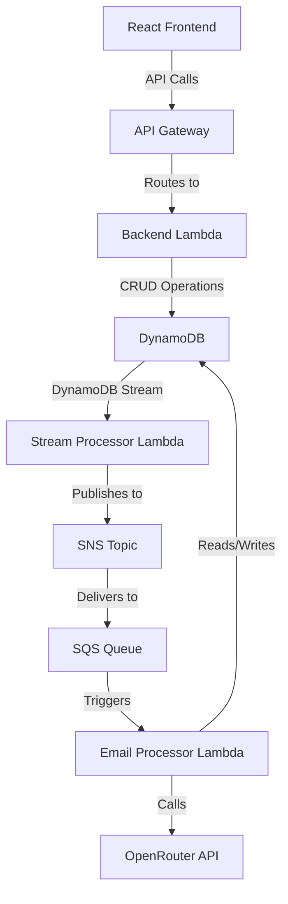
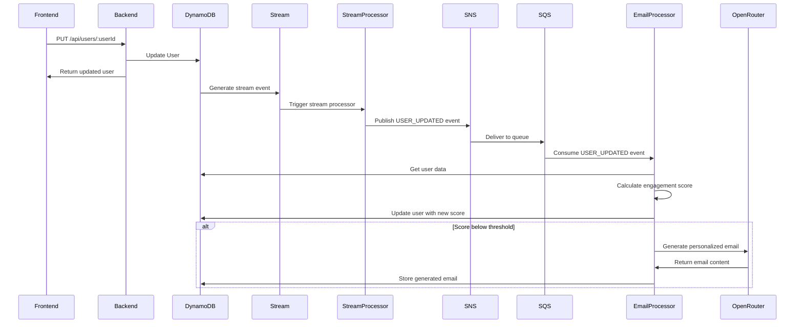
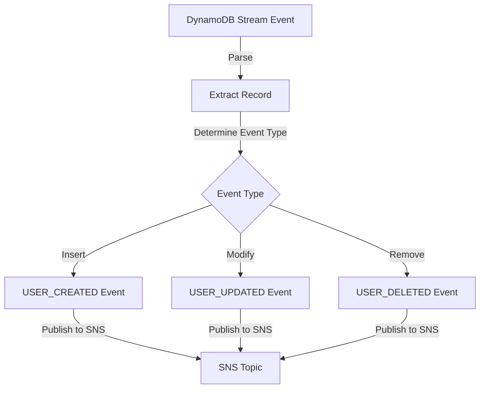
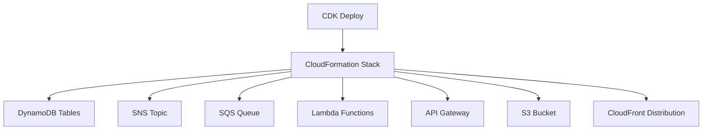

# Stitch Fix Client Engagement Acceleration System - Architecture

## Project Overview

This 1-day demo project addresses Stitch Fix's key business risk: "We may be unable to retain clients or maintain a high level of engagement with our clients." The system identifies at-risk customers and generates personalized re-engagement emails using LLM technology.

## System Architecture

The system follows an event-driven architecture with a simplified structure for demo purposes:



### Key Components

1. **Frontend Application**: Single React application with multiple views
   - User management interface
   - Email dashboard interface

2. **Backend Application**: Single Express.js application deployed as Lambda
   - API endpoints for users and emails
   - Database operations

3. **Stream Processor Lambda**: Processes DynamoDB stream events
   - Transforms database events into domain events
   - Publishes events to SNS for durable processing

4. **Email Processor Lambda**: Event-driven processor deployed as Lambda
   - Consumes events from SQS
   - Calculates engagement scores
   - Generates personalized emails using OpenRouter

5. **Data Storage**: DynamoDB tables
   - Users table with DynamoDB Stream enabled
   - Emails table

6. **Event Bus**: SNS topic + SQS queue for durable, rate-controlled processing

## 12-Factor App Implementation

1. **Codebase**: Single monorepo in Git
2. **Dependencies**: Explicitly declared and isolated
3. **Config**: Stored in environment variables
4. **Backing Services**: Treated as attached resources (DynamoDB, SNS, SQS)
5. **Build, Release, Run**: Strict separation between stages
6. **Processes**: Stateless processes with data in backing services
7. **Port Binding**: Services export via port binding
8. **Concurrency**: Scale via the process model (Lambda auto-scaling)
9. **Disposability**: Fast startup and graceful shutdown
10. **Dev/Prod Parity**: Same AWS services in all environments
11. **Logs**: Treated as event streams (CloudWatch)
12. **Admin Processes**: Run as one-off processes via CDK

## Project Structure

```
stitch-fix-application/
├── packages/
│   ├── shared/                   # Shared types and utilities
│   │   ├── src/
│   │   │   ├── types/            # Shared TypeScript interfaces
│   │   │   ├── schemas/          # Zod schemas
│   │   │   └── utils/            # Shared utility functions
│   ├── frontend/                 # React application
│   │   ├── src/
│   │   │   ├── components/       # React components
│   │   │   ├── pages/            # Page components
│   │   │   ├── services/         # API services
│   │   │   └── styles/           # CSS modules
│   ├── backend/                  # Express API server
│   │   ├── src/
│   │   │   ├── routes/           # API routes
│   │   │   ├── controllers/      # Request handlers
│   │   │   ├── services/         # Business logic
│   │   │   └── repositories/     # Data access
│   ├── stream-processor/         # DynamoDB Stream processor
│   │   ├── src/
│   │   │   ├── handlers/         # Stream event handlers
│   │   │   └── publishers/       # SNS publishers
│   ├── email-processor/          # Email generation processor
│   │   ├── src/
│   │   │   ├── handlers/         # SQS event handlers
│   │   │   ├── scoring/          # Scoring algorithm
│   │   │   └── email/            # Email generation
├── infrastructure/               # CDK infrastructure code
│   ├── src/
│   │   ├── stacks/               # CDK stacks
│   │   └── app.ts                # CDK app entry point
├── nx.json                       # Nx configuration
└── package.json                  # Root package.json
```

## Data Models

### User Model

```typescript
// Shared type definition
export interface User {
  userId: string;
  email: string;
  name: string;
  lastOrderDate: string;
  orderCount: number;
  averageOrderValue: number;
  preferredCategories: string[];
  engagementScore: number;
  lastEmailDate: string | null;
  createdAt: string;
  updatedAt: string;
}

// Zod schema for validation
export const UserSchema = z.object({
  userId: z.string().uuid(),
  email: z.string().email(),
  name: z.string().min(1),
  lastOrderDate: z.string().datetime(),
  orderCount: z.number().int().nonnegative(),
  averageOrderValue: z.number().nonnegative(),
  preferredCategories: z.array(z.string()),
  engagementScore: z.number().min(0).max(100).optional(),
  lastEmailDate: z.string().datetime().nullable(),
  createdAt: z.string().datetime(),
  updatedAt: z.string().datetime()
});
```

### Email Model

```typescript
// Shared type definition
export interface Email {
  emailId: string;
  userId: string;
  subject: string;
  content: string;
  generatedAt: string;
  engagementScoreAtTime: number;
  status: 'generated' | 'would_send';
  createdAt: string;
}

// Zod schema for validation
export const EmailSchema = z.object({
  emailId: z.string().uuid(),
  userId: z.string().uuid(),
  subject: z.string().min(1),
  content: z.string().min(1),
  generatedAt: z.string().datetime(),
  engagementScoreAtTime: z.number().min(0).max(100),
  status: z.enum(['generated', 'would_send']),
  createdAt: z.string().datetime()
});
```

### Event Model

```typescript
// Event types
export enum EventType {
  USER_CREATED = 'USER_CREATED',
  USER_UPDATED = 'USER_UPDATED',
  USER_DELETED = 'USER_DELETED',
  USER_SCORED = 'USER_SCORED',
  EMAIL_GENERATED = 'EMAIL_GENERATED'
}

// Event interface
export interface Event<T = any> {
  type: EventType;
  payload: T;
  timestamp: string;
}
```

## API Contracts

### User API

#### GET /api/users

**Response:**
```typescript
interface GetUsersResponse {
  users: User[];
}
```

#### GET /api/users/:userId

**Response:**
```typescript
interface GetUserResponse {
  user: User;
}
```

**Error Response:**
```typescript
interface ErrorResponse {
  error: string;
  message: string;
  statusCode: number;
}
```

#### POST /api/users

**Request:**
```typescript
interface CreateUserRequest {
  name: string;
  email: string;
  lastOrderDate: string;
  orderCount: number;
  averageOrderValue: number;
  preferredCategories: string[];
}
```

**Response:**
```typescript
interface CreateUserResponse {
  user: User;
}
```

#### PUT /api/users/:userId

**Request:**
```typescript
interface UpdateUserRequest {
  name?: string;
  email?: string;
  lastOrderDate?: string;
  orderCount?: number;
  averageOrderValue?: number;
  preferredCategories?: string[];
}
```

**Response:**
```typescript
interface UpdateUserResponse {
  user: User;
}
```

#### DELETE /api/users/:userId

**Response:**
```typescript
// Empty response with 204 status code
```

### Email API

#### GET /api/emails

**Query Parameters:**
```typescript
interface GetEmailsQuery {
  userId?: string;
  limit?: number;
  offset?: number;
}
```

**Response:**
```typescript
interface GetEmailsResponse {
  emails: Email[];
  total: number;
}
```

#### GET /api/emails/:emailId

**Response:**
```typescript
interface GetEmailResponse {
  email: Email;
}
```

### Health Check API

#### GET /api/health

**Response:**
```typescript
interface HealthCheckResponse {
  status: 'healthy' | 'unhealthy';
  version: string;
  timestamp: string;
  dependencies: {
    dynamoDB: 'connected' | 'error';
    sns?: 'connected' | 'error';
    sqs?: 'connected' | 'error';
    openRouter?: 'connected' | 'error';
  };
  details?: Record<string, any>;
}
```

## Event Flow

### User Update Flow



## DynamoDB Stream Processing

The Stream Processor Lambda transforms DynamoDB stream events into domain events:



## Engagement Scoring Algorithm

The engagement scoring algorithm uses a simple weighted approach:

1. Days since last order (higher weight)
2. Total order count (medium weight)
3. Average order value (medium weight)
4. Days since last email (lower weight)

```
function calculateEngagementScore(user):
  daysSinceLastOrder = calculateDaysSince(user.lastOrderDate)
  orderCountFactor = min(user.orderCount / 10, 1)
  aovFactor = min(user.averageOrderValue / 200, 1)
  daysSinceLastEmail = calculateDaysSince(user.lastEmailDate)
  
  // Lower score = higher risk of disengagement
  score = 100
  
  // Reduce score based on days since last order (higher impact)
  if daysSinceLastOrder > 90:
    score -= 40
  else if daysSinceLastOrder > 60:
    score -= 30
  else if daysSinceLastOrder > 30:
    score -= 15
  
  // Increase score based on order history
  score += orderCountFactor * 15
  score += aovFactor * 10
  
  // Adjust based on email recency
  if daysSinceLastEmail < 7:
    score -= 10  // Don't email too frequently
  
  return max(0, min(100, score))
```

## Email Generation Strategy

For users with an engagement score below a threshold (e.g., 50), the system generates a personalized email using OpenRouter. The prompt includes:

1. User's name
2. Order history summary
3. Preferred categories
4. Engagement score
5. Days since last order

The LLM generates a personalized email that:
- Acknowledges previous purchases
- Suggests new items based on preferences
- Includes a personalized note about why they might enjoy coming back to Stitch Fix

## AWS Infrastructure

### DynamoDB Tables

1. **Users Table**
   - Partition Key: `userId`
   - GSI: `engagementScore-index` (for querying at-risk users)
   - Stream: Enabled with NEW_AND_OLD_IMAGES

2. **Emails Table**
   - Partition Key: `emailId`
   - GSI: `userId-generatedAt-index` (for querying user's emails)

### Lambda Functions

1. **Backend Lambda**
   - Handles HTTP requests via API Gateway
   - Performs CRUD operations on DynamoDB

2. **Stream Processor Lambda**
   - Triggered by DynamoDB Stream events
   - Transforms database events into domain events
   - Publishes to SNS topic

3. **Email Processor Lambda**
   - Triggered by SQS events
   - Calculates engagement scores
   - Generates emails using OpenRouter
   - Updates DynamoDB

### SNS Topic

1. **User Events Topic**
   - Receives events from Stream Processor Lambda
   - Delivers events to SQS queue

### SQS Queue

1. **User Events Queue**
   - Subscribes to SNS topic
   - Triggers Email Processor Lambda
   - Provides durability and rate control

### S3 Bucket

1. **Frontend Assets Bucket**
   - Hosts React application
   - CloudFront distribution for CDN

## Environment Variables

### Shared Environment Variables
- `NODE_ENV`: Runtime environment (`development`, `production`)
- `LOG_LEVEL`: Logging level (`debug`, `info`, `warn`, `error`)

### Frontend Environment Variables
- `REACT_APP_API_URL`: URL of the API Gateway
- `REACT_APP_REGION`: AWS region

### Backend Lambda Environment Variables
- `USERS_TABLE_NAME`: Name of the DynamoDB users table
- `EMAILS_TABLE_NAME`: Name of the DynamoDB emails table
- `AWS_REGION`: AWS region
- `CORS_ORIGIN`: Allowed CORS origin

### Stream Processor Lambda Environment Variables
- `SNS_TOPIC_ARN`: ARN of the SNS topic
- `AWS_REGION`: AWS region

### Email Processor Lambda Environment Variables
- `USERS_TABLE_NAME`: Name of the DynamoDB users table
- `EMAILS_TABLE_NAME`: Name of the DynamoDB emails table
- `OPENROUTER_API_KEY`: API key for OpenRouter
- `ENGAGEMENT_THRESHOLD`: Threshold for generating emails (default: 50)
- `AWS_REGION`: AWS region

## Deployment Strategy

### Infrastructure Deployment

The infrastructure is deployed using AWS CDK:



1. **Build Process**
   - Build shared package: `nx run packages/shared:build`
   - Build backend: `nx run packages/backend:build`
   - Build stream processor: `nx run packages/stream-processor:build`
   - Build email processor: `nx run packages/email-processor:build`
   - Build frontend: `nx run packages/frontend:build`

2. **CDK Deployment**
   - Deploy infrastructure: `nx run infrastructure:deploy`

### CDK Stack Structure

```typescript
// Main stack structure
const stack = new cdk.Stack(app, 'ClientEngagementStack');

// DynamoDB tables
const usersTable = new dynamodb.Table(stack, 'UsersTable', {
  partitionKey: { name: 'userId', type: dynamodb.AttributeType.STRING },
  stream: dynamodb.StreamViewType.NEW_AND_OLD_IMAGES,
  // other properties...
});

const emailsTable = new dynamodb.Table(stack, 'EmailsTable', {
  // properties...
});

// SNS topic
const userEventsTopic = new sns.Topic(stack, 'UserEventsTopic');

// SQS queue
const userEventsQueue = new sqs.Queue(stack, 'UserEventsQueue');

// Subscribe queue to topic
userEventsTopic.addSubscription(new snsSubscriptions.SqsSubscription(userEventsQueue));

// Lambda functions
const backendLambda = new nodejs.NodejsFunction(stack, 'BackendLambda', {
  entry: '../packages/backend/dist/index.js',
  environment: {
    USERS_TABLE_NAME: usersTable.tableName,
    EMAILS_TABLE_NAME: emailsTable.tableName,
    AWS_REGION: stack.region,
    CORS_ORIGIN: '*'
  }
});

const streamProcessorLambda = new nodejs.NodejsFunction(stack, 'StreamProcessorLambda', {
  entry: '../packages/stream-processor/dist/index.js',
  environment: {
    SNS_TOPIC_ARN: userEventsTopic.topicArn,
    AWS_REGION: stack.region
  }
});

const emailProcessorLambda = new nodejs.NodejsFunction(stack, 'EmailProcessorLambda', {
  entry: '../packages/email-processor/dist/index.js',
  environment: {
    USERS_TABLE_NAME: usersTable.tableName,
    EMAILS_TABLE_NAME: emailsTable.tableName,
    OPENROUTER_API_KEY: process.env.OPENROUTER_API_KEY || 'placeholder',
    ENGAGEMENT_THRESHOLD: '50',
    AWS_REGION: stack.region
  }
});

// Event source mappings
streamProcessorLambda.addEventSource(new lambda.DynamoEventSource(usersTable, {
  startingPosition: lambda.StartingPosition.TRIM_HORIZON,
  batchSize: 10,
  retryAttempts: 3
}));

emailProcessorLambda.addEventSource(new lambda.SqsEventSource(userEventsQueue, {
  batchSize: 10
}));

// Permissions
usersTable.grantReadWriteData(backendLambda);
emailsTable.grantReadWriteData(backendLambda);
userEventsTopic.grantPublish(streamProcessorLambda);
usersTable.grantReadWriteData(emailProcessorLambda);
emailsTable.grantReadWriteData(emailProcessorLambda);

// API Gateway
const api = new apigateway.RestApi(stack, 'ClientEngagementApi', {
  // properties...
});

// S3 and CloudFront for frontend
const frontendBucket = new s3.Bucket(stack, 'FrontendBucket', {
  // properties...
});

const distribution = new cloudfront.Distribution(stack, 'FrontendDistribution', {
  // properties...
});
```

### Deployment Commands

The deployment process is automated using Nx commands:

```bash
# Build all packages
nx run-many --target=build --all

# Deploy infrastructure
nx run infrastructure:deploy

# Deploy frontend to S3
nx run packages/frontend:deploy
```

## Development Workflow

1. **Setup Environment**
   - Clone repository
   - Install dependencies with `npm install`
   - Configure AWS credentials

2. **Development**
   - Build shared package: `nx run packages/shared:build`
   - Deploy backend, stream processor, and email processor to AWS for testing
   - Start frontend locally: `nx run packages/frontend:serve`

3. **Testing**
   - Create test users through the UI
   - Update user data to trigger the DynamoDB Stream
   - View generated emails in the dashboard

## Demo Flow

1. **Introduction**
   - Explain the business problem (client engagement at Stitch Fix)
   - Describe the solution architecture

2. **User Management Demo**
   - Create sample users
   - Update user data to simulate different engagement scenarios

3. **Email Generation Demo**
   - Show how the system identifies at-risk users
   - Display generated personalized emails
   - Explain the personalization strategy

4. **Technical Deep Dive**
   - Explain the event-driven architecture with DynamoDB Streams
   - Discuss the engagement scoring algorithm
   - Show how the system scales and handles failures

5. **Business Impact**
   - Discuss potential ROI
   - Explain how this addresses Stitch Fix's key risk

## Implementation Plan

### Day 1 Timeline (8 hours)

#### Hour 1-2: Project Setup and Infrastructure
- Initialize Nx workspace
- Set up project structure
- Create CDK infrastructure

#### Hour 3-4: Backend and Stream Processor Implementation
- Implement shared types and schemas
- Create backend API endpoints
- Implement stream processor for DynamoDB events

#### Hour 5-6: Email Processor Implementation
- Implement engagement scoring algorithm
- Set up OpenRouter integration
- Implement email generation

#### Hour 7-8: Frontend and Testing
- Implement React frontend
- Deploy and test end-to-end flow
- Prepare demo script